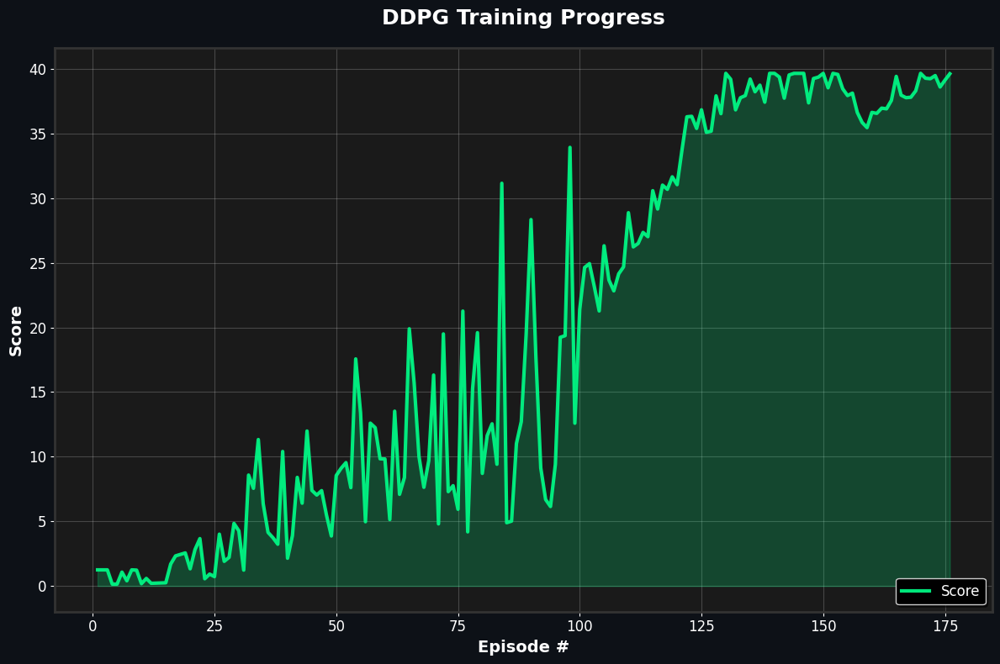

# Deep Deterministic Policy Gradient (DDPG) for Robotic Arm Control

## Summary

This project trains a reinforcement learning agent to control a double-jointed robotic arm, keeping its hand positioned at a target location for as long as possible. The agent receives a reward of **+0.1** for each timestep the hand remains in the goal location.

**Environment Details:**
- **Observation Space**: 33 variables (position, rotation, velocity, and angular velocities of the arm)
- **Action Space**: 4 continuous values (torque applied to two joints)
- **Success Criteria**: Average score of **+30** over 100 consecutive episodes

## Implementation

### Deep Deterministic Policy Gradient (DDPG)

The agent uses DDPG, an actor-critic algorithm designed for continuous control tasks. DDPG employs four neural networks to learn the optimal policy:

- **Local Actor Network**: Learns the current policy (state → action)
- **Target Actor Network**: Provides stable targets for training
- **Local Critic Network**: Evaluates state-action pairs (Q-values)
- **Target Critic Network**: Provides stable Q-value targets

### Network Architecture

**Actor Network** (`model.py`):
- Input: State (33 dimensions)
- Hidden Layers: 600 → 400 → 200 nodes
- Activation: ReLU for hidden layers, Tanh for output
- Output: Actions (4 continuous values)

**Critic Network** (`model.py`):
- Input: State (33 dimensions) + Actions (4 dimensions)
- Hidden Layers: (400 + action_size) → 300 nodes
- Activation: ReLU for hidden layers
- Output: Q-value (single value)

### Key Components

- **Experience Replay**: Stores and samples past experiences for stable learning (`ReplayBuffer.py`)
- **Ornstein-Uhlenbeck Noise**: Adds temporally correlated noise for exploration (`OUNoise.py`)
- **Soft Target Updates**: Gradually updates target networks for stability (`DDPGAgent.py`)

## Training Process

1. **Environment Reset**: Agent receives initial state
2. **Action Selection**: Actor network outputs action based on current policy
3. **Environment Step**: Execute action, receive reward and next state
4. **Experience Storage**: Save experience tuple in replay buffer
5. **Learning**: Sample batch of experiences and update networks
6. **Target Updates**: Soft update of target networks

The agent learns through:
- **Critic Update**: Minimize temporal difference error
- **Actor Update**: Maximize expected Q-value from critic
- **Target Updates**: Slowly blend local network weights into target networks

## Results

**🎯 Environment Solved in 176 Episodes!**

The agent successfully achieved an average score of **30.24** over 100 consecutive episodes.



### Training Progress
- Episodes 1-100: Gradual improvement from ~1 to ~8 average score
- Episodes 100-150: Rapid improvement, reaching consistent 20+ scores  
- Episodes 150-176: Stable performance above 30 average

### Hyperparameters

```python
BUFFER_SIZE = 100,000    # Replay buffer size
BATCH_SIZE = 128         # Training batch size
GAMMA = 0.99            # Discount factor
TAU = 0.001             # Soft update rate
LR_ACTOR = 1.5e-4       # Actor learning rate
LR_CRITIC = 1.5e-4      # Critic learning rate
WEIGHT_DECAY = 0.0001   # L2 regularization
```

### Saved Models
- `checkpoint_actor.pth`: Trained actor network weights
- `checkpoint_critic.pth`: Trained critic network weights

## File Structure

```
├── DDPGAgent.py       # DDPG Agent implementation
├── model.py           # Actor and Critic network architectures
├── OUNoise.py         # Ornstein-Uhlenbeck noise process
├── ReplayBuffer.py    # Experience replay buffer
├── Report.ipynb       # Training notebook and results analysis
├── checkpoint_actor.pth    # Saved actor weights
└── checkpoint_critic.pth   # Saved critic weights
```

## Ideas for Future Work

### Algorithm Improvements

**Twin Delayed DDPG (TD3)**
- Add clipped double Q-learning to reduce overestimation bias
- Implement delayed policy updates (update actor less frequently than critic)
- Add target policy smoothing with noise injection
- Expected improvement: More stable training and better final performance

**Distributed Distributional DDPG (D4PG)**
- Replace scalar Q-values with full return distributions
- Use multiple parallel actors for diverse experience collection
- Implement N-step returns for better temporal credit assignment
- Expected improvement: Faster convergence and more robust learning

**Prioritized Experience Replay (PER)**
- Sample experiences based on temporal difference error magnitude
- Focus learning on the most "surprising" transitions
- Use importance sampling to correct for sampling bias
- Expected improvement: 30-50% reduction in training episodes needed

### Exploration Strategies

**Parameter Space Noise**
- Add noise directly to neural network parameters instead of actions
- Provides more consistent exploration across different states
- Self-adapting noise levels based on policy changes
- Expected improvement: More effective exploration in complex environments

**Curiosity-Driven Learning**
- Implement intrinsic motivation based on prediction errors
- Reward agent for visiting novel states or learning new dynamics
- Combine with extrinsic rewards for better exploration-exploitation balance
- Expected improvement: Better performance in sparse reward environments

### Training Efficiency Improvements

**Multi-Agent Parallel Training**
- Train 20 identical agents simultaneously in separate environments
- Share experience replay buffer across all agents
- Accelerate learning through diverse parallel experiences
- Expected improvement: 5-10x faster wall-clock training time

**Curriculum Learning**
- Start with easier target positions (larger target zones)
- Gradually increase difficulty as agent improves
- Implement automatic difficulty adjustment based on success rate
- Expected improvement: More reliable convergence and reduced training variance

**Hindsight Experience Replay (HER)**
- Re-label failed experiences with alternative goals
- Learn from failures by treating them as successes for different objectives
- Particularly effective for goal-conditioned tasks
- Expected improvement: Better sample efficiency in goal-based environments

### Network Architecture Enhancements

**Attention Mechanisms**
- Add self-attention layers to focus on relevant state components
- Enable the agent to dynamically attend to important arm joint information
- Improve generalization to different arm configurations
- Expected improvement: Better performance with partial observations

**Residual Connections**
- Add skip connections in deeper networks to prevent gradient vanishing
- Enable training of much deeper networks (10+ layers)
- Improve gradient flow and training stability
- Expected improvement: Better representation learning with deeper networks

**Batch Normalization**
- Normalize inputs to each layer to stabilize training
- Reduce sensitivity to hyperparameter choices
- Enable higher learning rates for faster convergence
- Expected improvement: More robust training across different hyperparameter settings

### Hyperparameter Optimization

**Automated Hyperparameter Search**
- Use Bayesian optimization or population-based training
- Systematically explore learning rates, network sizes, and noise parameters
- Find optimal hyperparameter combinations automatically
- Expected improvement: 10-20% better final performance

**Adaptive Learning Rates**
- Implement learning rate schedules or adaptive optimizers (AdamW, RMSprop)
- Reduce learning rates as training progresses
- Use different schedules for actor and critic networks
- Expected improvement: More stable convergence and better final policies

**Dynamic Noise Scheduling**
- Start with high exploration noise, gradually reduce during training
- Implement noise decay based on performance milestones
- Add noise injection during evaluation to test robustness
- Expected improvement: Better exploration-exploitation balance throughout training

## Dependencies

```bash
pip install torch numpy matplotlib unityagents
```

## Usage

```python
# Train new agent (see Report.ipynb for full implementation)
from DDPGAgent import Agent

# Load trained agent
agent = Agent(state_size=33, action_size=4, random_seed=42)
agent.actor_local.load_state_dict(torch.load('checkpoint_actor.pth'))
agent.critic_local.load_state_dict(torch.load('checkpoint_critic.pth'))
```

---

*This implementation demonstrates the power of DDPG for continuous control tasks, successfully teaching a robotic arm to maintain precise positioning through reinforcement learning.*
